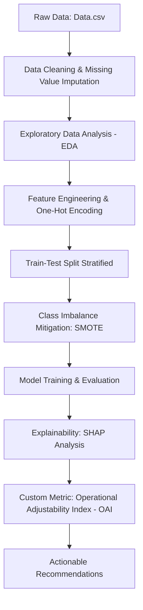

# ✈️ Flight Delay Prediction & Operational Analysis

An end-to-end data science and machine learning pipeline to analyze historical flight data, predict arrival delays (occurrence and duration), and quantify controllable operational factors using a custom **Operational Adjustability Index (OAI)** and **SHAP (SHapley Additive Explanations)**.

---

## 📌 Project Overview
Flight delays result in significant financial losses for airlines and scheduling challenges for passengers. This project uses a dataset of approximately **179,000 flight records** to:
1. **Identify** key drivers of arrival delays.
2. **Predict** delay occurrences (Classification) and delay duration (Regression).
3. **Quantify Actionability** using the custom OAI metric to isolate and focus on factors that airlines can actually control (e.g., carrier operations, turnaround times).
4. **Deliver** data-driven operational recommendations for airline dispatch and gate management.

---

## 📊 Dataset & Feature Schema
The dataset consists of historical flight records containing operational characteristics and delay breakdowns.

### Complete Data Dictionary & Explanations

The dataset contains the following columns, describing temporal context, airline details, flight counts, disruptions, and delay breakdowns:

| Column Name | Category | Description / Definition |
| :--- | :---: | :--- |
| **year** | Temporal | Year of the flight records (YYYY format). |
| **month** | Temporal | Month of the flight records (MM format: `1` to `12`). |
| **carrier** | Airline | Unique 2-character code assigned by the U.S. DOT to identify the airline. |
| **carrier_name** | Airline | Full legal name of the reporting carrier. |
| **airport** | Location | 3-character IATA alpha-numeric code identifying the destination airport. |
| **airport_name** | Location | Full name and description of the destination airport. |
| **arr_flights** | Flight Metric | Total number of arriving flights at the destination airport. |
| **arr_del15** | Delay Metric | Total number of arrived flights delayed by 15 minutes or more. (A flight is considered "on-time" if it arrives less than 15 minutes after its scheduled time). |
| **arr_cancelled** | Disruption | Total number of scheduled flights that were cancelled. |
| **arr_diverted** | Disruption | Total number of scheduled flights that were diverted to an alternate airport. |
| **arr_delay** | Delay Metric | Total difference in minutes between scheduled and actual arrival times. Early arrivals show negative numbers. |
| **carrier_ct** | Delay Share | Share/count of delayed flights attributed specifically to carrier-controlled factors. |
| **weather_ct** | Delay Share | Share/count of delayed flights attributed to weather conditions. |
| **nas_ct** | Delay Share | Share/count of delayed flights attributed to National Aviation System (NAS) conditions. |
| **security_ct** | Delay Share | Share/count of delayed flights attributed to security events. |
| **late_aircraft_ct**| Delay Share | Share/count of delayed flights caused by the late arrival of the previous flight leg. |
| **carrier_delay** | Delay Severity | Sum of delay duration (in minutes) caused by carrier factors (e.g. maintenance, crew, operations). |
| **weather_delay** | Delay Severity | Sum of delay duration (in minutes) caused by extreme weather conditions. |
| **nas_delay** | Delay Severity | Sum of delay duration (in minutes) caused by National Aviation System constraints. |
| **security_delay**| Delay Severity | Sum of delay duration (in minutes) caused by airport security activities. |
| **late_aircraft_delay** | Delay Severity | Sum of delay duration (in minutes) caused by the late arrival of the preceding flight leg. |

### Engineered Features & Targets

| Target Feature | Type | Definition & Purpose |
| :--- | :---: | :--- |
| **is_delayed** | Binary | **Classification Target**: Set to `1` if the arrival delay `arr_del15` > 0 (delayed 15+ minutes), otherwise `0`. |
| **arr_delay_oai** | Continuous | **Regression Target**: OAI-weighted delay severity score prioritizing controllable factors ($2.0 \times \text{carrier} + 2.0 \times \text{late\_aircraft} + 1.0 \times (\text{weather} + \text{nas} + \text{security})$). |

---

## ⚙️ Methodology & Pipeline

The pipeline follows a structured machine learning workflow:



### 1. Data Processing
*   **Data Cleaning**: Dropped rows with missing `arr_del15` values. Checked and confirmed no duplicates.
*   **Categorical Encoding**: Categorical features (`carrier`, `airport`, `month`, `year`) encoded using One-Hot Encoding.
*   **Leakage Prevention**: Dropped columns representing targets or raw components of the target (e.g. `arr_del15`, cancel/divert attributes) to prevent data leakage.
*   **Imbalance Correction**: Applied **SMOTE (Synthetic Minority Over-sampling Technique)** with a 30% minority sampling strategy to address class imbalance during classification training.

### 2. Operational Adjustability Index (OAI)
A custom metric designed to prioritize controllable delays over uncontrollable environmental delays.
*   **Concept**: Factors like weather or NAS capacity are uncontrollable, while crew schedules, turnaround procedures, and airline-specific carrier delays are controllable.
*   **OAI Target Formula**:
    $$\text{OAI-Weighted Delay} = 2.0 \times (\text{carrier\_delay} + \text{late\_aircraft\_delay}) + 1.0 \times (\text{weather\_delay} + \text{nas\_delay} + \text{security\_delay})$$
*   **OAI Model Interpretability Score**: Calculated using SHAP feature importances to determine the percentage of predictions driven by controllable features:
    $$\text{OAI} = \frac{\sum |SHAP_{\text{controllable}}|}{\sum |SHAP_{\text{total}}|}$$

---

## 🤖 Model Performance & Evaluation

Multiple architectures were built, tuned, and compared for both classification and regression.

### 1. Classification (Delay Occurrence Prediction)
*Tested threshold optimization using **Youden's J Statistic** to balance sensitivity and specificity.*

| Model | Accuracy | F1-Score | ROC-AUC | Summary / Evaluation |
| :--- | :---: | :---: | :---: | :--- |
| **Logistic Regression** | 71.0% | 0.40 | 0.69 | Collapses on positive class (61% recall, 0.09 precision); not usable. |
| **XGBoost Classifier** | 88.0% | 0.89 | 0.76 | Decent overall performance, but slightly higher false positive rate. |
| **Random Forest Classifier** 🏆 | **91.0%** | **0.91** | **0.77** | **Selected**: Best balance of precision, F1-score, and recall on delayed class. |

### 2. Regression (Delay Duration Prediction)
*Trained on the custom OAI-weighted delay target.*

| Model | MAE (mins) | RMSE (mins) | $R^2$ Score | Summary / Evaluation |
| :--- | :---: | :---: | :---: | :--- |
| **Linear Regression** | $1.2 \times 10^7$ | $4.5 \times 10^8$ | -11,000.0 | Failed completely due to high dimensionality and multicollinearity. |
| **XGBoost Regressor** | 2,752 | 5,850 | 0.81 | Decent baseline regressor with quick training execution. |
| **Random Forest Regressor** 🏆 | **2,739** | **5,720** | **0.83** | **Selected**: Best predictive power, lowest errors, and highest $R^2$ score. |

---

## 🔍 Key Insights & Explainability (SHAP)
By evaluating the top 50 features of the Random Forest models via **SHAP (SHapley Additive Explanations)**, we unlocked the following findings:

*   **OAI Score = 0.5051 (Classification) & 0.5050 (Regression)**: Approximately **50.5%** of the models' predictions are driven by controllable factors (e.g., airline scheduling, carrier turnarounds, standby management).
*   **Carrier Dynamics**: Carriers like **Southwest (WN)** and **American Airlines (AA)** have highly positive SHAP values, indicating they are major statistical contributors to delay risks.
*   **Seasonality**: Monthly analysis shows peaks in delays during **April, May, and June** (summer vacation rush) as well as year-end holidays.
*   **Traffic Congestion**: Busiest airport hubs like **ORD (Chicago)**, **DFW (Dallas)**, and **ATL (Atlanta)** are strong predictive features for increased delay times.

---

## 📌 Actionable Consulting Recommendations

Based on the EDA and machine learning findings, the following strategies are proposed:

> [!TIP]
> **1. Improve On-Time Turnarounds for Key Carriers**
> Focus audits and ground support on carriers showing the highest delay rates (specifically **WN**, **AA**, and **DL**). Strengthen turnaround protocols and track actual vs. scheduled departure windows.

> [!IMPORTANT]
> **2. Optimize Ground Operations to Reduce Controllable Delays**
> Since over 50% of delay severity is controllable (OAI ≈ 0.50), airlines must improve ground-handling coordination. Synced staffing, immediate gate readiness tracking, and reserve crew allocation can mitigate late aircraft delay cascades.

> [!WARNING]
> **3. Allocate Standby Aircraft and Crew in Peak Season (April–June)**
> Schedule buffer capacity (standby aircraft and crew) during historically high-risk summer months to absorb cascading delays before they disrupt subsequent flight legs.

> [!NOTE]
> **4. Reschedule/Re-route Congested Hubs**
> For high-congestion hubs like **ORD** and **DFW**, adjust schedules to avoid tight scheduling windows and overlap of flights sharing the same aircraft gates.

---

<!-- ## 📁 Repository Structure
```directory
.
├── Additionals/
│   ├── main.pdf              # PDF export of project notebook/presentation
│   └── main.py               # Executable Python script containing the modeling code
├── Column_Definitions.xlsx   # Descriptions of metadata and column schemas
├── Data.csv                  # Main dataset containing raw flight records (~179,000 rows)
├── main.ipynb                # Primary Jupyter Notebook for EDA & model training
└── README.md                 # Project documentation (this file)
```

---

## 🚀 How to Run the Project

### Prerequisites
Make sure you have python and the necessary libraries installed:
```bash
pip install numpy pandas matplotlib seaborn scikit-learn xgboost imbalanced-learn shap openpyxl
```

### Running the Notebook
You can open and execute the analysis step-by-step:
```bash
jupyter notebook main.ipynb
```

### Running the Python Script
Alternatively, run the script version located in the `Additionals` folder:
```bash
python Additionals/main.py
``` -->